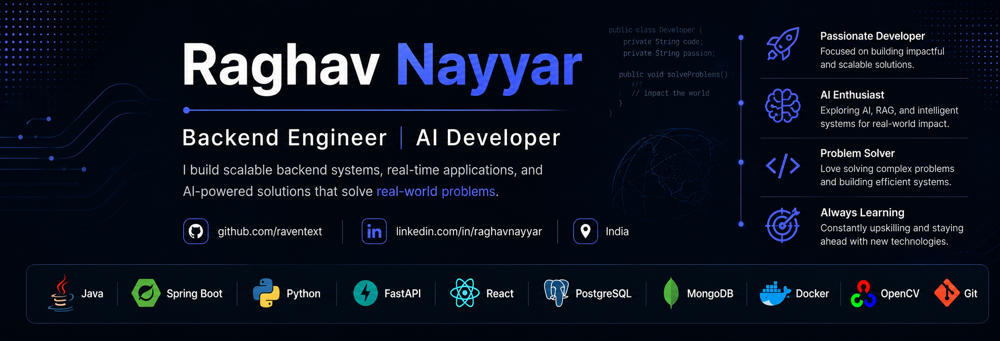

  

# Hi, I'm Raghav Nayyar 👋

### Computer Science Engineer | Backend Developer | AI Enthusiast

I'm a Computer Science Engineer from VIT Vellore passionate about building scalable backend systems, real-time applications, and AI-powered products.

* 🔭 Currently building AI-powered applications and distributed systems
* 🌱 Exploring System Design, Cloud Technologies, and Agentic AI
* 💼 Former Backend Intern at Andritz Technologies
* 🏆 Patent Filed: Adaptive Visual Command Execution System for Remote Communication
* ☁️ Microsoft Azure Fundamentals (AZ-900)
* 🤖 Oracle OCI Generative AI Certified
* 🇮🇳 Based in India

---

## 🚀 Tech Stack

### Languages

### Backend & APIs

### Frontend

### Databases

### Tools & Technologies

---

## 📌 Featured Projects

### 🤝 CollabAI

AI-powered collaborative document editor featuring real-time editing, document-aware chat, summarization, rewriting, and Retrieval-Augmented Generation (RAG).

### 🏢 Multi-Tenant SaaS Backend

Secure multi-tenant backend built using Spring Boot, JWT Authentication, Spring Security, and PostgreSQL with complete tenant isolation.

### 🤖 Agentic RAG System

Advanced Retrieval-Augmented Generation system utilizing autonomous agents, contextual retrieval, and LLM-powered workflows.

### 🎥 Vision-Based Control System

Gesture-controlled video conferencing platform using OpenCV and MediaPipe with real-time command execution.

### 🎙️ Deep Fake Audio Recognition

Machine learning system designed to identify synthetic and manipulated speech samples.

### 📊 Report Automation System

Industrial reporting platform developed during internship work to automate dynamic report generation and data processing.

---

## 💼 Experience

### Backend Intern | Andritz Technologies

**May 2025 – July 2025**

* Developed Spring Boot REST APIs for industrial data reporting systems
* Automated reporting workflows across 300+ DCB and Inverter units
* Improved data retrieval performance through dynamic JSON-based loaders
* Worked with PostgreSQL, Grafana, Postman, and enterprise-scale datasets

---

## 🏆 Achievements

* Patent Filed: Adaptive Visual Command Execution System for Remote Communication
* Microsoft Azure Fundamentals (AZ-900)
* Oracle OCI Generative AI Certification
* Completed McKinsey Forward Program (Leadership, Problem Solving & Professional Development)
---

## 🌐 Connect With Me

---

### "Building scalable systems, intelligent applications, and solutions that create impact."
